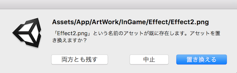

# unity-overwriter

  
Unityにアセットを追加する際に上書きを可能にする拡張です。
  
詳しい解説は[**こちら**](https://amagamina.jp/overwriter/)

## ライセンス条項

MITライセンス
https://opensource.org/licenses/mit-license.php  
  
コード内のライセンス表記を残して頂ければ自由に使用可能です。
  
Copyright (c) 2019 ina-amagami (ina@amagamina.jp)
